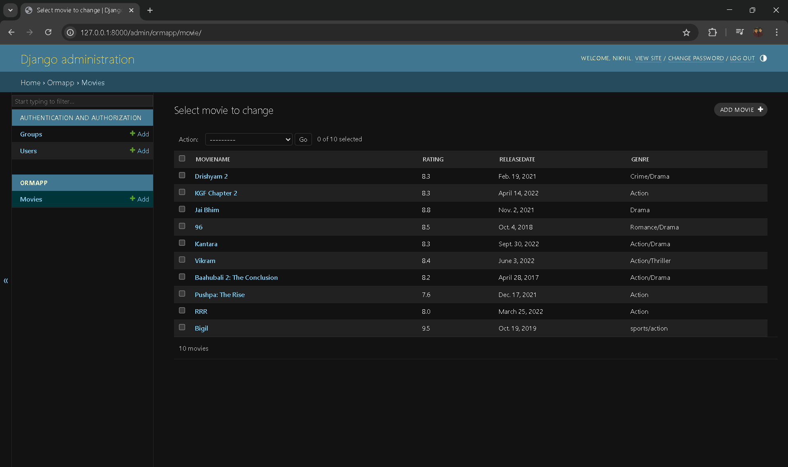

# Ex02 Django ORM Web Application
## Date: 

## AIM
To develop a Django application to store and retrieve data from a Movies Database using Object Relational Mapping(ORM).

## ENTITY RELATIONSHIP DIAGRAM


## DESIGN STEPS

### STEP 1:
Clone the problem from GitHub

### STEP 2:
Create a new app in Django project

### STEP 3:
Enter the code for admin.py and models.py

### STEP 4:
Execute Django admin and create details for 10 Movies

## PROGRAM
```
Admin.py

from django.contrib import admin
from .models import Movie, MovieAdmin

admin.site.register(Movie, MovieAdmin)


Models.py

from django.db import models
from django.contrib import admin

class Movie(models.Model):
    MovieName = models.CharField(max_length=100)
    Rating = models.FloatField()
    ReleaseDate = models.DateField()
    Genre = models.CharField(max_length=50)

    def __str__(self):
        return self.MovieName

class MovieAdmin(admin.ModelAdmin):
    list_display = ('MovieName', 'Rating', 'ReleaseDate', 'Genre')
```


## OUTPUT




## RESULT
Thus the program for creating movies database using ORM hass been executed successfully
